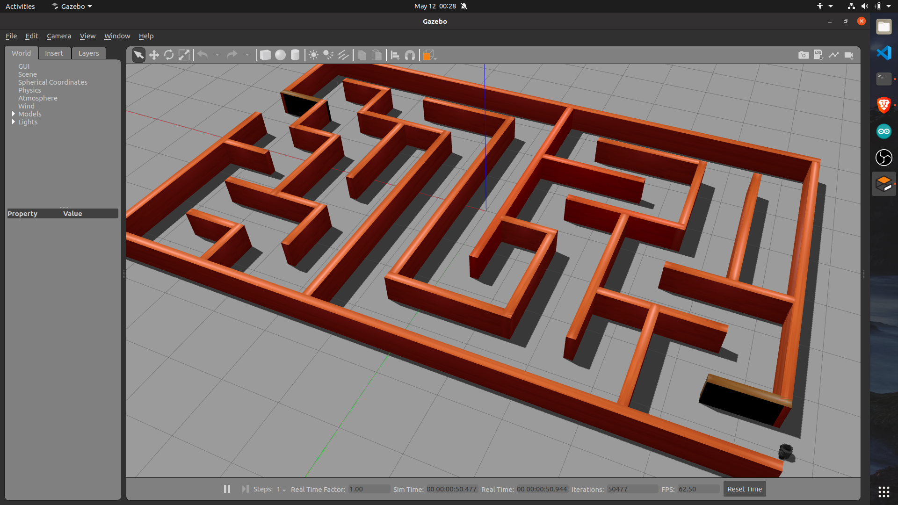

# Turtlebot3 Simulation Packages    

## Steps for installation:    
### 1. Create and setup a ros workspace using following commands in your home directory   
```    
mkdir -p catkin_ws/src
```    
```    
cd catkin_ws && catkin_make
```    
```    
echo "source ~/catkin_ws/devel/setup.bash" >> ~/.bashrc
```
```    
source ~/.bashrc
```    
```    
echo "export TURTLEBOT3_MODEL=burger" >> ~/.bashrc
```

### 2. clone this repo in src folder of your catkin workspace and do catkin make  
```    
cd ~/catkin_ws/src
```
```   
git clone https://github.com/ab31mohit/turtlebot3_packages
```    
```    
cd .. && catkin_make    
```

## Using packages :   
## 1. Steps for using turtlebot3_mazesolver package    
 a. paste the **my_maze1** folder from turtlebot3_packages/turtlebot3_mazesolver/others to 
    .gazebo/models folder of your home directory    
        
 b. run followig command to launch the maze world    
 ``` 
 roslaunch turtlebot3_mazesolver turtlebot3_maze_world.launch
 ```    
     
 you will see a world as shown below    
     
 
